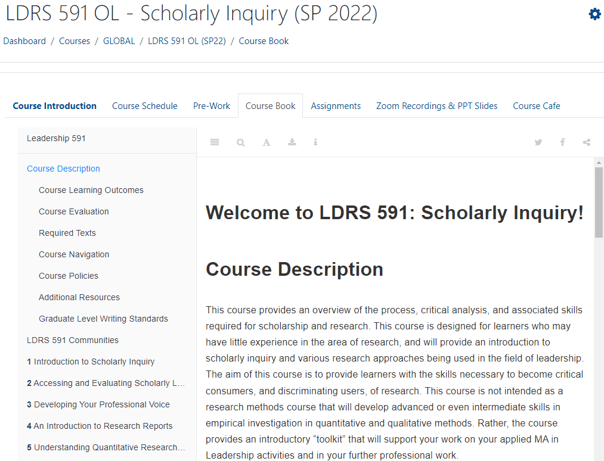
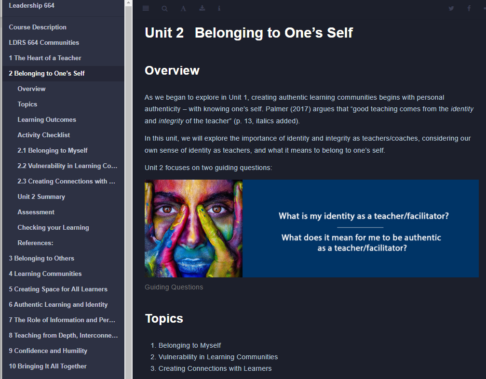
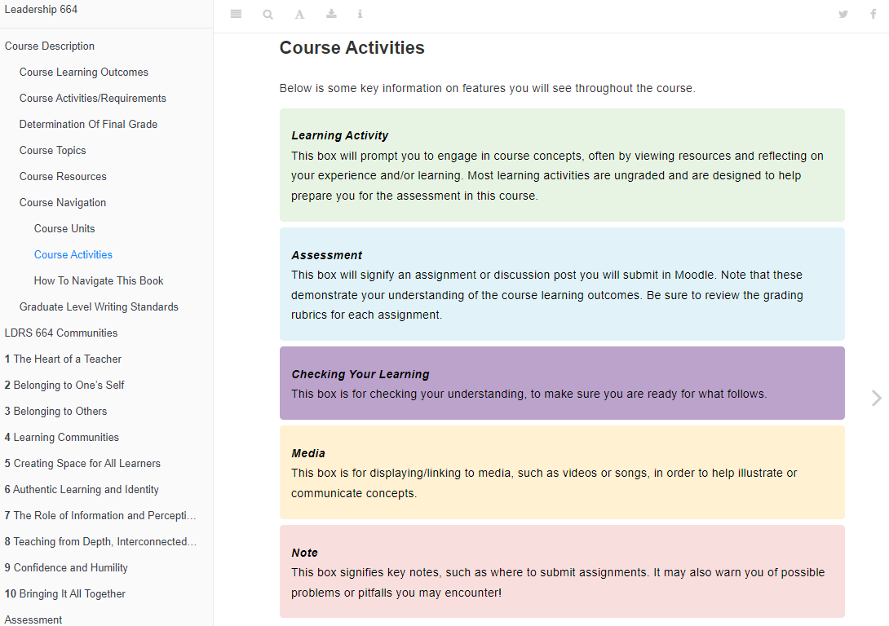
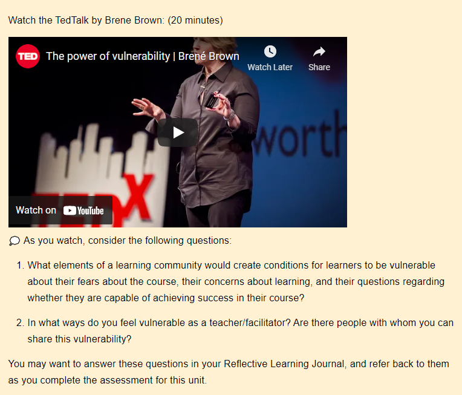

# Bookdown Advantages

## Overview {-}
There are many advantages for using the Bookdown as a course resource. As you view the features below, consider whether you can use Bookdown to share access with learners.

##  Accessible {-}

1. **Open access to course materials:** A Course Book created with Bookdown is a simple URL! Students do not need to login to Moodle to access the book.  They can also download as a pdf or epub (discussed below), so limited wifi shouldn't be an issue.

1. **Integration with Moodle:** The CourseBook can be embedded in a tab in Moodle, so students can access the book within their Moodle shell.

1. **Mobile-friendly:** Easy to navigate on various devices.  This is especially important for our International students.

1. **Collaborative infrastructure for design & maintenance (GitHub):** GitHub allows course writers to track changes, collaborate on material, and update all versions of courses without having to edit each Moodle shell of a course.  Our TWU Online team has been using GitHub since 2018, so the integration of RStudio went fairly smoothly.

## Features {-}

1. **Displays as ebook**
1. **Generates table of contents**
1. **Integrated search function**
1. **Generates ePub or PDF**

## Appearance {-}

1. **Font:** Can increase or decrease the size of the font, as well as change the font family to either Serif or Sans.

1. **Background:** Can choose a white, sepia, or night background.  The night background in particular helps those with screen fatigue.

## Design {-}
1. **Blocks:** We use blocks for activities, notes, assessment, resources, etc.

1. **Side menu:** Displays the layout of the course and units to help with navigation.

1. **Icons:** Easy to add icons for activities (we use [emojipedia](https://emojipedia.org/)😊)

## Integration {-}
1. **Integration of a variety of interactive activities:** H5P, Padlet, Hypothesis, discussions, graphs, maps, etc.

1. **Ability to link to other sections of the book/course:** footnotes, references, glossary, etc.

1. **Embedded content:** slides, videos, pdfs, etc.

## Reproducible {-}
1. **Reproducible:** If the repository is open to the public, you can fork (copy) it and use it for your own purposes.
1. **Dynamic stats with R:** Many stats courses use Bookdown as it displays synamic stats.
